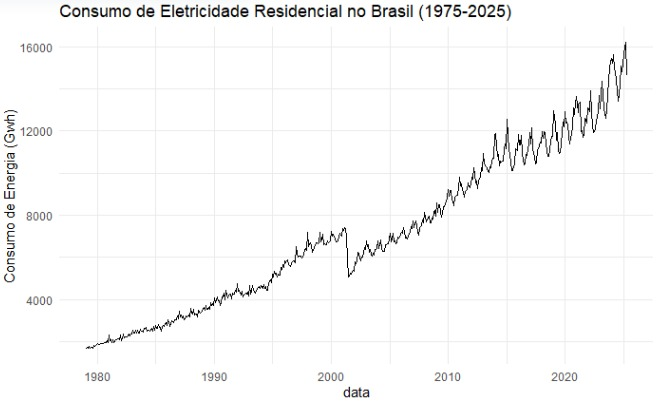
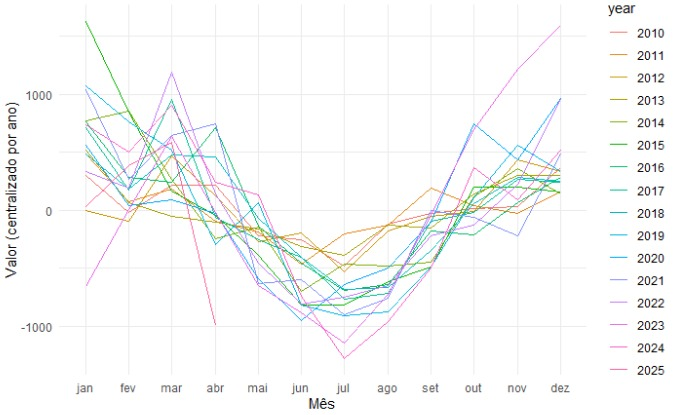
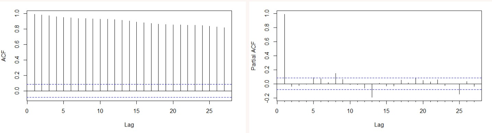
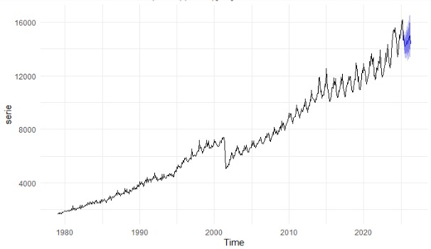

# Time-Series Energy Forecasting — ME607 (UNICAMP)

Disciplina ME607 – Séries Temporais (Estatística/UNICAMP)
Autores: Mateus Samuel Risso, Décio Miranda Filho, Nathan Augusto Elias, João Paulo de Castro Alves

Previsão do consumo residencial de eletricidade no Brasil usando modelos clássicos de séries temporais. O projeto compara diferentes abordagens (AR, ARIMA, Prophet e SARIMA) e documenta o processo de obtenção de dados, tratamento, validação cruzada, diagnóstico e geração de previsões.

Motivação

Prever picos de consumo e demanda energética (para planejamento).

Prevenir períodos de escassez e apoiar políticas públicas.

Entender o impacto de fenômenos naturais (La Niña, El Niño, estiagem etc.) em escala nacional.

Dados

Série: Consumo elétrico residencial do Brasil (mensal).

Período: jan/1979 – jan/2025.

Origem: Banco Central do Brasil – SGS (Sistema Gerenciador de Séries Temporais), com dados da Eletrobrás.

Acesso: construção de URL para comunicação direta com a API do BCB (dados em JSON), convertidos em DataFrame para análise.

Padrão de URL (SGS):

https://api.bcb.gov.br/dados/serie/bcdata.sgs.{CODIGO_SGS}/dados?formato=json

Parâmetros opcionais de janela temporal:

.../dados?formato=json&dataInicial=01/01/1979&dataFinal=01/01/2025

Ambiente & Reprodutibilidade
Python
python -m venv .venv
source .venv/bin/activate  # (Windows: .venv\Scripts\activate)
pip install pandas numpy matplotlib statsmodels prophet scikit-learn requests

Exemplo mínimo (JSON → DataFrame):

import requests, pandas as pd

CODIGO_SGS = "<preencha_o_codigo_da_serie>"
url = f"https://api.bcb.gov.br/dados/serie/bcdata.sgs.{CODIGO_SGS}/dados?formato=json"
raw = requests.get(url, timeout=30).json()

df = pd.DataFrame(raw)                 # Conversão para DataFrame
df["data"] = pd.to_datetime(df["data"], dayfirst=True)
df["valor"] = pd.to_numeric(df["valor"], errors="coerce")
df = df.sort_values("data").set_index("data")

R
install.packages(c("httr","jsonlite","dplyr","ggplot2","forecast","tseries"))
library(httr); library(jsonlite); library(dplyr)

CODIGO_SGS <- "<preencha_o_codigo_da_serie>"
url <- sprintf("https://api.bcb.gov.br/dados/serie/bcdata.sgs.%s/dados?formato=json", CODIGO_SGS)
raw <- content(GET(url), as = "text", encoding = "UTF-8") |> fromJSON()

df <- as.data.frame(raw) |>
  mutate(data = as.Date(data, format = "%d/%m/%Y"),
         valor = as.numeric(valor)) |>
  arrange(data)

Nota: O tratamento foi realizado em Python e em R (para comparabilidade).

Tratamento & EDA

Principais etapas:

Conversão de datas com pd.to_datetime(..., dayfirst=True) e ordenação crescente.

Conversão de “valor” para float.

Remoção de tendência, análise de sazonalidade (período de 12 meses), transformação log/Box–Cox quando adequado.

Decomposição aditiva (tendência, sazonalidade e resíduo).

Visualizações (dos slides)

Comportamento da série:

Sazonalidade mensal por ano:

ACF e PACF:

Modelagem

Modelos candidatos (baseado nos gráficos e na estrutura de autocorrelação):

AR(3)

ARIMA (3,1,2)

Prophet

SARIMA (1,0,3)(0,0,1)[12] (modelo sazonal)

Validação cruzada (janela temporal) — métricas normalizadas:

Modelo	MSE_CV	RMSE_CV
AR(3)	0.9105	0.9542
Prophet	9.9601	3.1561
ARIMA (3,1,2)	1.0922	1.0451
SARIMA (1,0,3)(0,0,1)	0.8364	0.9145

Modelo escolhido: SARIMA (1,0,3)(0,0,1) (pela presença clara de sazonalidade e melhor desempenho na CV).

Diagnóstico do modelo SARIMA

Testes aplicados aos resíduos (valores-p muito pequenos indicaram violações):

Ljung–Box: evidências de autocorrelação residual.

Kolmogorov–Smirnov: não-normalidade dos resíduos.

ARCH (Engle) / McLeod–Li: sinais de heterocedasticidade condicional e autocorrelação nos resíduos ao quadrado.

Interpretação: apesar do bom desempenho na validação cruzada, os resíduos não são plenamente satisfatórios (há espaço para melhorar com transformações, outlier handling, modelos SARIMA alternativos ou outras classes de modelos).

Previsões

Gráfico de previsões com intervalo de confiança (modelo SARIMA):

Estrutura do repositório

Os nomes abaixo refletem o conteúdo do repositório público.

.
├── LSTM_series (1).ipynb          # experimento exploratório em deep learning (baseline)
├── arima.R
├── reg_series.R
├── series_sarimax.R
├── naive_sazonal.R
├── suav_exp.R
├── series_temporais_trabalho2_modelos_diagnost....R   # scripts auxiliares (diagnóstico/plots)
├── README.md
└── (figuras) imagem_serie_1.png | series_image_2.png | series_image_3.png | series_image_4.png

Conclusões

Prophet e modelos de ML testados não tiveram bom desempenho neste conjunto (neste horizonte e granularidade).

O melhor desempenho na CV foi do SARIMA (1,0,3)(0,0,1) (coerente com a sazonalidade mensal).

Os diagnósticos de resíduos apontam violações importantes (autocorrelação, não-normalidade e heterocedasticidade), sugerindo espaço para refino do modelo.

Próximos passos (sugestões)

Ajustar especificações sazonais alternativas (p, q sazonais diferentes) e comparar via AICc/BIC.

Tratar outliers e quebras estruturais (ex.: pandemia) com dummies/intervenções.

Considerar SARIMAX com variáveis exógenas (temperatura, renda, preços, indicadores climáticos ENSO).

Reavaliar transformações (Box–Cox) e variância não constante.

Repetir CV com janelas deslizantes e diferentes horizontes.

Referência de curso

Este trabalho foi desenvolvido na disciplina ME607 – Séries Temporais (Estatística/UNICAMP).

Como citar este repositório

Risso, M. S.; Miranda Filho, D.; Elias, N. A.; Castro Alves, J. P. de.
Time-Series Energy Forecasting (ME607 – UNICAMP). 2025. Repositório GitHub.
